# Allergen Intelligence Platform - System Architecture

## Table of Contents
- [Overview](#overview)
- [High-Level Architecture](#high-level-architecture)
- [Component Diagram](#component-diagram)
- [Product Analysis Flow](#product-analysis-flow)
- [Three-Tier Caching Strategy](#three-tier-caching-strategy)
- [Authentication Flow](#authentication-flow)
- [Database Schema](#database-schema)
- [Technology Stack](#technology-stack)
- [Performance Characteristics](#performance-characteristics)

## Overview

The Allergen Intelligence Platform is a production-grade REST API that translates product ingredient labels into comprehensive allergen safety reports. The system uses a sophisticated three-tier caching strategy to minimize API costs while maintaining fast response times.

**Key Innovation:** Automatic identification of allergenic oxidation products (e.g., Limonene → Limonene hydroperoxide) that traditional ingredient searches miss.

## High-Level Architecture


## Component Diagram


## Product Analysis Flow

This is the complete end-to-end flow when a user requests product analysis:

```mermaid
sequenceDiagram
    participant User
    participant Frontend
    participant Controller as AllergenSearchController
    participant Service as OpenAISearchService
    participant PubChem as PubChemService
    participant DBCache as Database Cache
    participant VectorCache as Vector Cache
    participant OpenAI as OpenAI API
    participant Tracking as UsageTrackingService
    
    User->>Frontend: "Analyze CeraVe Cream"
    Frontend->>Controller: POST /api/allergen/analyze-product<br/>{productName: "CeraVe Cream"}
    
    Note over Controller,Service: Step 1: Extract Ingredients
    Controller->>Service: analyzeProduct()
    Service->>OpenAI: Extract ingredient list
    OpenAI-->>Service: ["Cetearyl Alcohol", "Glycerin", ...]
    Service->>Tracking: Track tokens (100 tokens)
    
    Note over Service,OpenAI: Step 2: Analyze Each Ingredient
    loop For each ingredient
        Service->>DBCache: findByCommonName("Cetearyl Alcohol")
        
        alt Database Cache Hit
            DBCache-->>Service: Return Chemical + SideEffects
            Note over Service: ✅ <10ms, 0 tokens
        else Database Cache Miss
            Service->>VectorCache: semanticSearch("Cetearyl Alcohol")
            
            alt Vector Cache Hit
                VectorCache-->>Service: Return cached analysis
                Service->>DBCache: Save to database
                Note over Service: ✅ ~100ms, 0 tokens
            else Vector Cache Miss
                Service->>PubChem: searchChemical("Cetearyl Alcohol")
                PubChem-->>Service: CAS, IUPAC, SMILES
                Service->>DBCache: Save chemical data
                
                Service->>OpenAI: Search allergen effects
                OpenAI-->>Service: Side effects data
                Service->>Tracking: Track tokens (~200 tokens)
                
                Service->>OpenAI: Search oxidation products
                OpenAI-->>Service: Oxidation compounds
                Service->>Tracking: Track tokens (~200 tokens)
                
                Service->>DBCache: Save side effects
                Service->>VectorCache: Cache for future queries
                Note over Service: ⚠️ 5-10s, ~400 tokens
            end
        end
    end
    
    Service-->>Controller: ProductAnalysisResponse
    Controller-->>Frontend: JSON Response
    Frontend-->>User: Display safety report
    
    Note over User,Tracking: First Analysis: ~4,100 tokens<br/>Repeat Analysis: ~100 tokens<br/>97.5% cost savings! 🎉
```



## Three-Tier Caching Strategy

The platform uses a sophisticated three-tier caching approach to minimize costs:

```mermaid
graph TD
    A[Incoming Query:<br/>"Analyze Limonene"] --> B{Tier 1:<br/>Database Cache}
    
    B -->|✅ HIT| C[Return from PostgreSQL<br/>Response Time: <10ms<br/>Token Cost: 0]
    
    B -->|❌ MISS| D{Tier 2:<br/>Vector Cache<br/>pgvector}
    
    D -->|✅ HIT| E[Semantic Search Match<br/>Response Time: ~100ms<br/>Token Cost: 0]
    
    E --> F[Parse & Save to DB]
    F --> C
    
    D -->|❌ MISS| G[Tier 3:<br/>OpenAI API Call]
    
    G --> H[Search PubChem<br/>for Chemical Data]
    H --> I[Search Allergen<br/>Side Effects<br/>~200 tokens]
    I --> J[Search Oxidation<br/>Products<br/>~200 tokens]
    J --> K[Total: ~400 tokens<br/>Response Time: 5-10s]
    
    K --> L[Cache in Vector Store]
    L --> M[Save to Database]
    M --> C
    
    style C fill:#c8e6c9
    style E fill:#fff9c4
    style K fill:#ffccbc
    style B fill:#e1f5fe
    style D fill:#f3e5f5
```

### Cache Performance Metrics

| Metric | Database Cache | Vector Cache | OpenAI API |
|--------|---------------|--------------|------------|
| **Response Time** | <10ms | ~100ms | 5-10s |
| **Token Cost** | 0 | 0 | ~400 tokens |
| **Cost per Query** | $0 | $0 | ~$0.002 |
| **Hit Rate** | ~80% (mature) | ~15% | ~5% |

**Example Savings:**
- First product analysis: ~4,100 tokens ($0.021)
- Repeat analysis: ~100 tokens ($0.0005)
- **Cost reduction: 97.5%**

## Authentication Flow


## Database Schema


### Key Relationships

1. **Users ↔ Refresh Tokens**: One-to-many relationship for session management
2. **Chemical Identification ↔ Side Effects**: One-to-many relationship storing allergen data
3. **Users ↔ Usage Tracking**: One-to-many relationship for cost monitoring

### Indexes

- `users.email` - Unique index for login lookup
- `refresh_tokens.token` - Unique index for token validation
- `refresh_tokens.user_id` - Foreign key index
- `chemical_identification.common_name` - Unique index for cache lookup
- `side_effect.chemical_id` - Foreign key index
- `usage_tracking.user_id` - Foreign key index for user stats

## Technology Stack

### Backend Framework
- **Spring Boot 3.5.6** - Modern Java framework with virtual threads
- **Java 21** - Latest LTS with pattern matching, records
- **Maven** - Dependency management

### AI/ML Integration
- **Spring AI 1.0.2** - Native Spring integration for AI services
- **OpenAI GPT-4o** - Advanced LLM with web search capability
- **JTokkit 1.1.0** - Token counting (tiktoken port)

### Database
- **PostgreSQL 17** - Primary relational database
- **pgvector 0.5.1** - Vector similarity search extension
- **Spring Data JPA** - ORM and repository abstraction

### Security
- **Spring Security 6.5.5** - Authentication/Authorization framework
- **JJWT 0.12.3** - JWT token generation and validation
- **BCrypt** - Password hashing with adaptive cost

### External APIs
- **PubChem REST API** - Chemical structure and identifier lookup
- **OpenAI API** - LLM completions with web search

## Performance Characteristics

### Response Times


### Cost Analysis

**First Product Analysis (20 ingredients):**
- Ingredient list extraction: 100 tokens
- 20 ingredients × 200 tokens each: 4,000 tokens
- **Total: ~4,100 tokens (~$0.021)**

**Repeat Analysis (all cached):**
- Ingredient list extraction: 100 tokens
- All ingredients cached: 0 tokens
- **Total: ~100 tokens (~$0.0005)**

**Savings: 97.5%** 🎉

### Scalability Considerations

1. **Database Connection Pooling**: HikariCP for efficient connection management
2. **Stateless Authentication**: JWT tokens enable horizontal scaling
3. **Shared Cache**: Every user's query benefits everyone (network effect)
4. **Async Processing**: Virtual threads for concurrent API calls
5. **Rate Limiting**: Per-user token budgets (future implementation)

### Cache Strategy Evolution


**Key Insight:** The system becomes more cost-effective and faster as it's used, creating a positive feedback loop.

---

## Future Architecture Enhancements

### Planned Improvements (see ROADMAP.md)

1. **Redis Layer**: Add in-memory cache for ultra-fast repeated queries
2. **Elasticsearch**: Full-text search across ingredients
3. **GraphQL API**: Alternative to REST for flexible queries
4. **Rate Limiting**: Tiered user limits (free vs paid)
5. **WebSocket Support**: Real-time analysis streaming
6. **Microservices**: Split into separate services as load increases

### Deployment Architecture (Future)


---

**Last Updated:** December 2025  
**Author:** Matthew Bixby  
**Related Documents:** [README.md](../README.md) | [API.md](./API.md) | [ROADMAP.md](./ROADMAP.md)